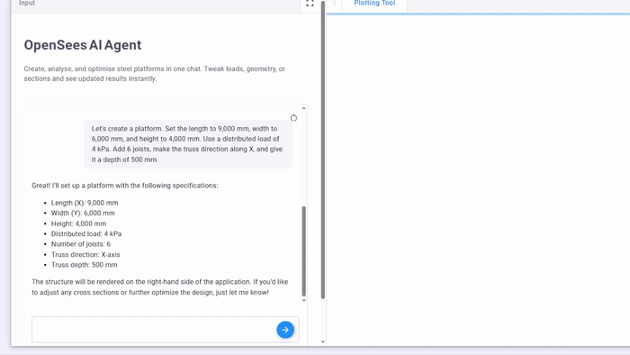
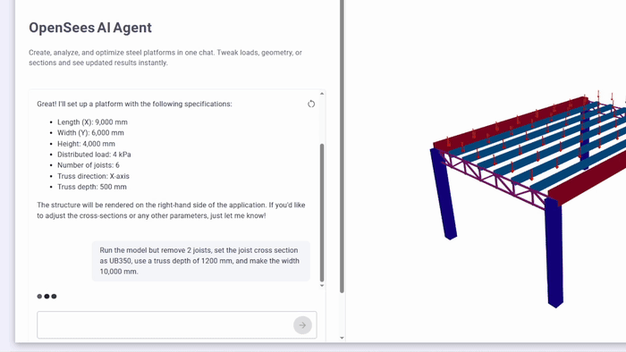
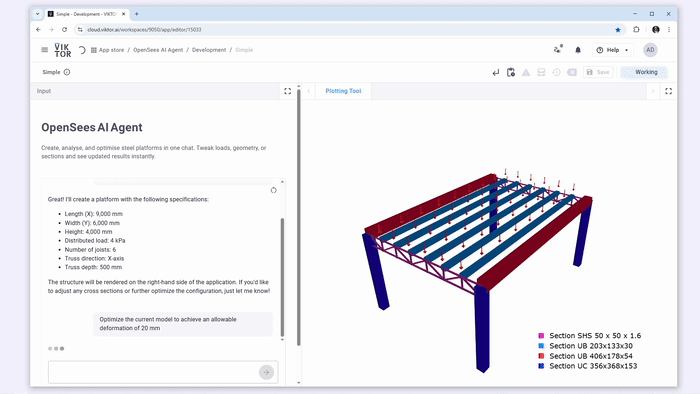

# OpenSees AI Agent
AI agent powered by large language models (LLM) that allows users to simply "talk" with the agent to create, analyze, and optimize steel platform structural models.

**Important:** OpenSeesPy is free for research, education, and internal use. Commercial redistribution of OpenSeesPy—such as an application or cloud-based service that uses `import openseespy`—requires a license similar to that required for commercial redistribution of OpenSees.exe. Contact [UC Berkeley](https://opensees.github.io/OpenSeesDocumentation/developer/license.html) for commercial licensing details.

---
## Main Features
The following are the main features of the app. Each one is powered by an AI agent that understands your instructions and connects directly with OpenSeesPy to build, analyze, and optimize steel platform structures.


### Create Structural Model
Instead of filling long forms, you just describe the structure in plain English. The AI agent takes care of generating the geometry in OpenSeesPy, including joists, beams, supports, and loads. You can quickly modify the model by sending follow-up prompts.



### Run Structural Model
Once your geometry is ready, the agent runs the analysis using OpenSees. It simulates the structure, shows displacements, and gives quick feedback using 3D views, so you can review and iterate instantly, without touching the code.




### Optimize Structural Model
Ask the agent to optimize the structure by minimizing weight or meeting displacement targets. It runs several design options using OpenSees, then shows the best-performing model and recommendations, all inside the chat.


ssets\optimization.gif

---

## How the APP works

The application has 4 main components:

1. **Geometry Generation in Python**

    The geometry of the model is created using plain Python. We create the node coordinates and lines connecting two nodes, and then we assign a section and a material to the line to create a member. Since this geometry is created programmatically, we can parametrically change this geometry fast. The geometry components are found in `app/geometry`.

2. **Structural Engine OpenSees**

    As mentioned earlier, OpenSees is the structural engine of the application. It receives the geometry (lines, nodes, material, members) and creates and runs the FE model of the platform. The OpenSees helper functions and classes can be found in `app/opensees`.

3. **AI Agent: Instructor + OpenAI**

    The app needs access to the OpenAI API to function properly. It uses [structured outputs](https://platform.openai.com/docs/guides/structured-outputs?api-mode=chat), which help you retrieve data in predictable and easily manageable formats. To simplify working with structured outputs, the app leverages the [Instructor](https://python.useinstructor.com/) framework. Instructor makes it straightforward to define how you want your model responses structured. You can quickly learn how to use Instructor in just a few minutes [here](https://python.useinstructor.com/#getting-started). The Geometry Creation and the Structural Analysis capabilities of OpenSees are wrapped in "Tools"; their definition can be found in `app/llm_engine.py`.

4. **VIKTOR.AI: Integration and UI**

    VIKTOR.AI is the integration of all these features. The main features to highlight are the following:

    - [`vkt.Chat`](https://docs.viktor.ai/docs/create-apps/user-input/llm-chat/): A UI component for an LLM that can be connected to multiple AI providers.
    - [`vkt.PlotlyView`](https://docs.viktor.ai/docs/create-apps/results-and-visualizations/plots-charts-graphs/): Allows rendering of Plotly 3D scenes. The agent has access to tools that generate these scenes, and VIKTOR renders the output in a `vkt.PlotlyResult`.
    - [`vkt.Storage`](https://docs.viktor.ai/docs/create-apps/results-and-visualizations/storing-results/): VIKTOR Storage makes it possible to share the agent's output between VIKTOR Views. For example, when the agent creates the content of a [Plotly scene in JSON](https://plotly.com/chart-studio-help/json-chart-schema/), it is serialized as a string and sent to storage. Then, the `vkt.PlotlyResult` checks if something is in storage, and if it is, it parses and renders the scene.


---
## Handling API Keys
To use this application, you need an API key from OpenAI. There are different ways to provide this key depending on your environment.

### For Local Development
When running the app on your local machine, you have two options:

**1. Using a `.env` File**
This is the most common method for local development.
1.  Copy the `.env.example` file to a new file named `.env` in the project's root directory.
2.  Add your API key to the `.env` file:
    ```
    OPENAI_API_KEY="your-openai-api-key"
    ```
    The `python-dotenv` module automatically loads these keys as environment variables. **Never commit your `.env` file or expose your API keys publicly.**

**2. Using the VIKTOR CLI**
You can also pass the API key as an environment variable directly when starting the app using the `--env` or `-e` flag:
```bash
viktor-cli start --env OPENAI_API_KEY="your-api-key"
```

### For Published Apps on the VIKTOR Platform
For apps deployed on the VIKTOR platform, the most secure method is to use VIKTOR's environment variables. Administrators can set these via the 'Apps' menu in your VIKTOR environment. These variables are encrypted.

For detailed instructions, refer to the [VIKTOR environment variables documentation](https://docs.viktor.ai/docs/create-apps/development-tools-and-tips/environment-variables/).

You can get an OpenAI API key by following the instructions in the [`vkt.Chat` documentation](https://docs.viktor.ai/docs/create-apps/user-input/llm-chat/).

## Useful Links for You

-   **Instructor Framework**:
    -   [Getting Started](https://python.useinstructor.com/#getting-started)
    -   [Integrations (OpenAI, Gemini, etc.)](https://python.useinstructor.com/integrations/)
-   **OpenAI**:
    -   [API Documentation](https://platform.openai.com/docs)
    -   [OpenAI Cookbook](https://cookbook.openai.com/)
-   **VIKTOR Platform**:
    -   [VIKTOR Chat Component (`vkt.Chat`)](https://docs.viktor.ai/docs/create-apps/user-input/llm-chat/)
    -   [VIKTOR Storage Component (`vkt.Storage`)](https://docs.viktor.ai/docs/create-apps/results-and-visualizations/storing-results/)
    -   [VIKTOR Plotly View Component (`vkt.PlotlyView`)](https://docs.viktor.ai/docs/create-apps/results-and-visualizations/plots-charts-graphs/)
    -   [Environment Variables](https://docs.viktor.ai/docs/create-apps/development-tools-and-tips/environment-variables/)
-   **OpenSeesPy Documentation**:
    -   [Model Commands](https://openseespydoc.readthedocs.io/en/latest/src/modelcmds.html)
    -   [Structure Commands](https://openseespydoc.readthedocs.io/en/latest/src/structure.html)
st/src/structure.html
---